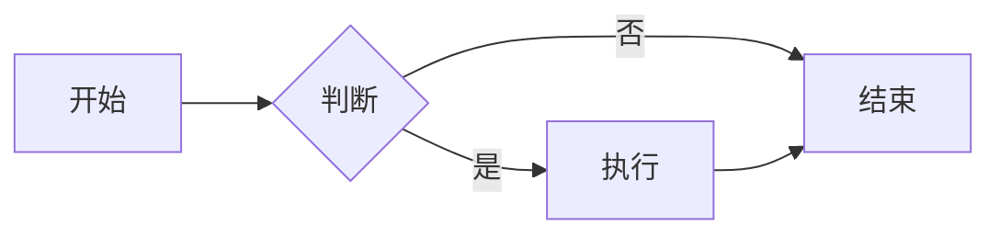
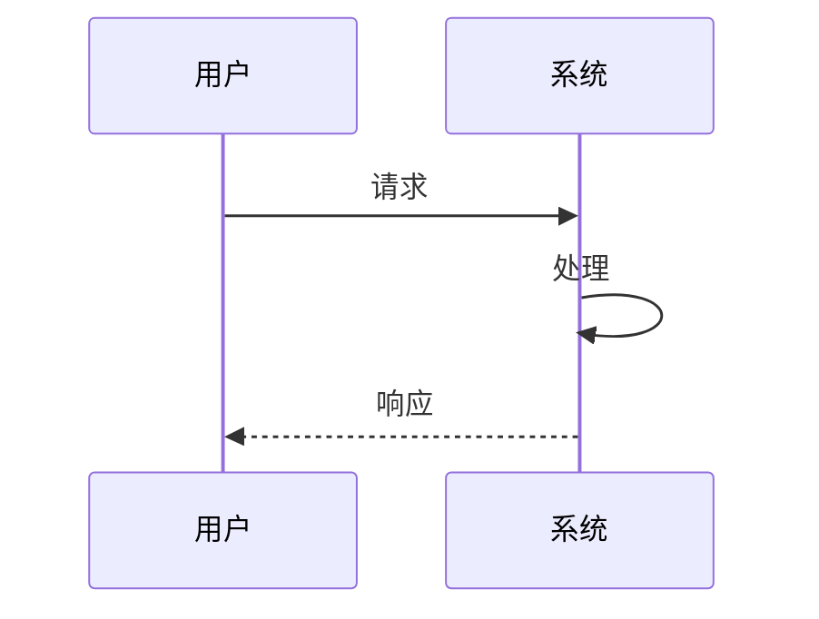
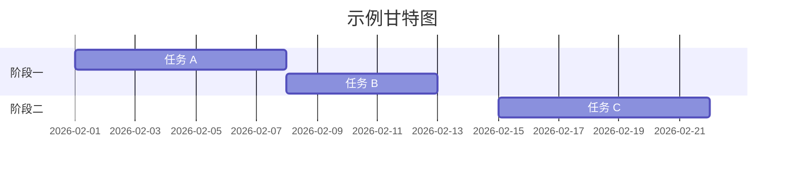

# Mermaid 图表示例

本页用于验证 Milestone 3：构建期 Mermaid 代码块会转换为 SVG 展示。

## Flowchart 流程图

```mermaid
flowchart LR
  A[开始] --> B{判断}
  B -->|是| C[执行]
  B -->|否| D[结束]
  C --> D
```

## Sequence 序列图

```mermaid
sequenceDiagram
  participant U as 用户
  participant S as 系统
  U->>S: 请求
  S->>S: 处理
  S-->>U: 响应
```

## Gantt 甘特图

```mermaid
gantt
  title 示例甘特图
  dateFormat YYYY-MM-DD
  section 阶段一
  任务 A :a1, 2026-02-01, 7d
  任务 B :a2, after a1, 5d
  section 阶段二
  任务 C :a3, 2026-02-15, 7d
```

以上图表均应在构建期被转换为 SVG，页面不加载 Mermaid 运行时。
